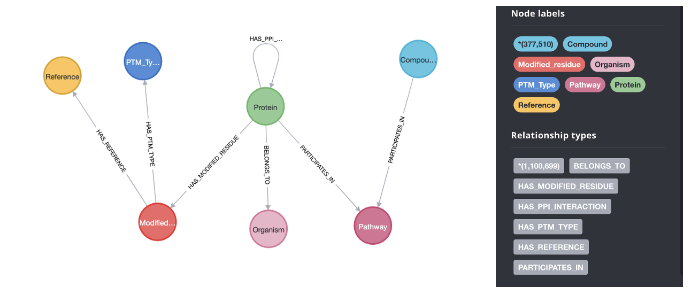

## Exploration of Post-translational modifications (PTMs) through knowledge graph approach.

### Description: 

Knowledge Graphs can link diverse sets of data and facts, reveal new relationships, and suggest mechanisms for further study. In this project, various data sets (e.g., Proteins, PTM Types, Pathways, Associated Compounds, References, Organism) are extracted from biomedical databases and systematically integrated into the Knowledge Graph (KG). In the first place, integrated KG assists in the advanced search and implementation of graph algorithms for underpinning hidden relationships and biomarkers. (e.g., centrality, community). Next, KG becomes the underlying infrastructure for developing advanced graph-based machine learning (e.g., Graph Neural Network (GNN), Heterogeneous Graph Transformer (HGT)) for link prediction, which further assists in predicting new PTM types for the proteins.

### Use case: 

Post-translational modifications (PTMs), particularly the oxidative modifications at cysteine residues, can have profound effects on the activity, stability, and interaction of proteins. Understanding oxidative modifications at cysteine residues in crucial mitochondrial ADP/ATP carrier proteins could provide key insights into disrupted cellular energy regulation, affecting conditions like cardiovascular and metabolic diseases. The current knowledge of PTM identification of proteins are mainly based on experimental technique like mass spectrometry and are usually studied in isolation. There's a need for a comprehensive view that connects these PTMs to functional outcomes in the cellular context. 
